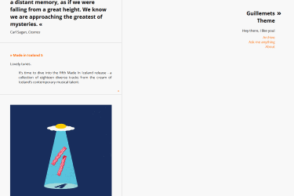

# Tumblr Themes

The source code of all Tumblr themes I've [submitted to the Theme Garden](https://www.tumblr.com/themes/by/noahdoersing), listed here in reverse chronological order of initial release:

Name | Theme ID | Source Code | Thumbnail
-----|----------|-------------|----------
**CODE&SPACE** | [40771](https://www.tumblr.com/theme/40771) | [`CODE&SPACE/`](CODE&SPACE) | 
**Minimax** | [39182](https://www.tumblr.com/theme/39182) | [`Minimax/`](Minimax) | 
**GreyGray** | [37212](https://www.tumblr.com/theme/37212) | [`GreyGray/`](GreyGray) | 
**Guillemets** | [35101](https://www.tumblr.com/theme/35101) | [`Guillemets/`](Guillemets) | 

## Miscellaneous

The [`unfinished/`](unfinished) directory contains some **themes in varying states of completion** – I'm not likely to actually finish them, so if you like, go ahead and do whatever you want with them.

In [`Snippets.md`](Snippets.md), I've listed a few HTML5 code snippets that proved to be **handy for rapid Tumblr theme development**.
